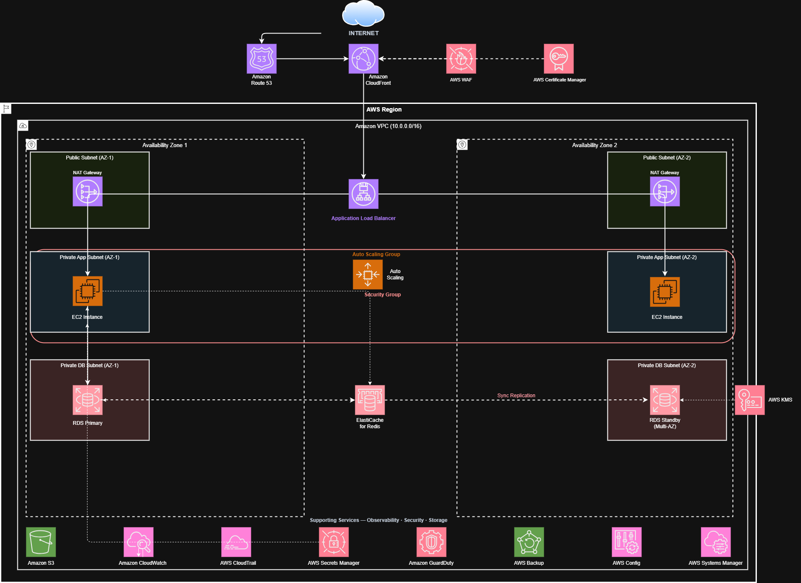

# AWS Well-Architected Framework & Cloud Adoption Framework Assessment

**Lab:** Design and Evaluate an AWS Solution Using the Well-Architected and Cloud Adoption Frameworks
**Workload:** Two-Tier Web Application Migration (On-Premises → AWS)
**Date:** February 19, 2026
**Author:** Cloud Architecture Team

---

## Table of Contents

1. [Task 1 – Existing Architecture Review](#task-1--existing-architecture-review)
2. [Task 2 – Well-Architected Framework Evaluation](#task-2--well-architected-framework-evaluation)
3. [Task 3 – Cloud Adoption Framework Analysis](#task-3--cloud-adoption-framework-analysis)
4. [Task 4 – Improved Architecture Design](#task-4--improved-architecture-design)
5. [Reflection](#reflection)

---

## Task 1 – Existing Architecture Review

### Workload Summary

The workload being migrated is a **two-tier web application** consisting of:

- **Tier 1 – Frontend:** A web server hosting a public-facing application (HTML/CSS/JS or server-rendered pages). On-premises this runs on a single physical or virtual server.
- **Tier 2 – Backend Database:** A relational database (e.g., MySQL or PostgreSQL) hosted on a second on-premises server, directly accessed by the frontend application.

In the current on-premises state, both tiers communicate over a private LAN. There is no load balancer, no redundancy, and management is entirely manual.

### Identified Components

| Component | On-Premises Equivalent | Notes |
|---|---|---|
| Web Server | Physical/VM running Apache/Nginx | Single point of failure |
| Application Logic | Embedded in web server | No separation of concerns |
| Relational Database | MySQL/PostgreSQL on a dedicated server | No replication |
| Networking | Private LAN | Flat network, no segmentation |
| Storage | Local disk | No offsite backups |
| Security | Firewall rules | Likely overly permissive |
| Monitoring | Absent or manual | No alerting or dashboards |

### Identified Risks and Weaknesses

**Single Points of Failure:** Both the web server and database server are singular instances. Any hardware failure causes a complete outage. There is no failover mechanism.

**No Backup or Disaster Recovery Strategy:** Data resides only on local disks with no automated backups, no point-in-time recovery, and no documented recovery time objective (RTO) or recovery point objective (RPO).

**Overly Permissive Security Groups / Firewall Rules:** Without a formal security review, it is likely that network access is broader than necessary — for example, the database may be reachable from any machine on the network rather than exclusively from the application layer.

**No Encryption in Transit or at Rest:** On-premises environments frequently lack TLS between tiers and unencrypted disk storage is common.

**No Scalability:** The architecture cannot scale horizontally. A traffic spike will degrade or crash the application.

**No Monitoring or Observability:** There is no centralized logging, metrics collection, or alerting. Incidents are discovered reactively rather than proactively.

**Manual Patching and Operations:** Infrastructure changes require manual intervention, increasing the risk of configuration drift and human error.

**No Cost Visibility:** On-premises infrastructure costs are fixed and opaque; there is no per-service cost attribution.

---

## Task 2 – Well-Architected Framework Evaluation

### Assessment Table

| Pillar | Observation | Improvement Recommendation | Supporting AWS Service |
|---|---|---|---|
| **Operational Excellence** | **Strength:** Migration presents an opportunity to adopt infrastructure-as-code from day one, eliminating manual configuration drift. **Weakness:** No CI/CD pipeline, no runbooks, and no automated deployment process exist currently. All changes are applied manually via SSH. | Implement infrastructure-as-code for all AWS resources and establish a deployment pipeline with automated testing, rollback capability, and documented runbooks for common operational tasks. | **AWS CloudFormation** or **AWS CDK** for IaC; **AWS CodePipeline** for CI/CD; **AWS Systems Manager** for runbooks and patch management |
| **Security** | **Strength:** Moving to AWS provides access to a mature shared responsibility model and a rich set of managed security services. **Weakness:** Current architecture likely has flat networking, no secret management, no encryption, and no audit trail. Security groups may be overly permissive (e.g., port 3306 open to 0.0.0.0/0). | Implement network segmentation with a VPC containing public subnets (web tier) and private subnets (database tier). Remove all 0.0.0.0/0 ingress rules. Encrypt data at rest and in transit. Centralize secrets management and enable CloudTrail for a full audit trail. | **Amazon VPC** with public/private subnets; **AWS Secrets Manager**; **AWS KMS**; **AWS WAF**; **AWS CloudTrail**; **Amazon GuardDuty** |
| **Reliability** | **Strength:** AWS provides native tools for high availability that would require significant capital expenditure on-premises. **Weakness:** The current single-AZ, single-instance architecture has zero redundancy. A single hardware fault causes a complete outage with no automated recovery. | Deploy the web tier across multiple Availability Zones behind an Application Load Balancer using an Auto Scaling Group. Migrate the database to a managed Multi-AZ deployment with automated failover and automated backups with point-in-time recovery. | **Elastic Load Balancing (ALB)**; **Amazon EC2 Auto Scaling**; **Amazon RDS Multi-AZ**; **Amazon Route 53** for DNS failover; **AWS Backup** |
| **Performance Efficiency** | **Strength:** AWS allows right-sizing and the ability to change instance types easily without hardware procurement. **Weakness:** On-premises hardware is fixed and likely over-provisioned for average load but under-provisioned for peak load. There is no caching layer, and static assets are served directly from the application server. | Introduce a CDN to cache and serve static assets at the edge, reducing origin load. Add an in-memory caching layer between the application and database to reduce read latency and database load. Leverage Auto Scaling to match compute capacity to actual demand. | **Amazon CloudFront** (CDN); **Amazon ElastiCache for Redis** (caching); **AWS Compute Optimizer** for right-sizing recommendations |
| **Cost Optimization** | **Strength:** Pay-as-you-go pricing eliminates upfront capital expenditure and allows cost to track actual usage. **Weakness:** Without tagging, budgets, or monitoring, there is no visibility into cloud spend. There is a risk of over-provisioning and leaving unused resources running. | Implement a resource tagging strategy for cost allocation. Enable AWS Cost Explorer and set billing alerts. Use Reserved Instances or Savings Plans for predictable baseline workloads, and On-Demand or Spot Instances for variable or batch workloads. | **AWS Cost Explorer**; **AWS Budgets**; **AWS Compute Savings Plans**; **AWS Trusted Advisor** |

---

## Task 3 – AWS Cloud Adoption Framework (CAF) Analysis

### Business Perspective

The Business perspective ensures that cloud investments are aligned with business outcomes and that stakeholders understand the value of the migration. For this organization, the business case for migration centers on reducing operational risk, improving application availability, and enabling future scalability without capital investment cycles.

Key actions required include developing a formal business case document that quantifies the total cost of ownership (TCO) of the on-premises environment versus the projected AWS costs, including migration expenses. Leadership must establish measurable success criteria — for example, targeting 99.9% uptime, a 30% reduction in infrastructure operating costs within 12 months, and sub-2-second page load times.

Stakeholder alignment is a critical enabler. Business owners, finance, IT leadership, and the development team must agree on migration scope, timeline, and expected outcomes. A phased migration roadmap should be communicated broadly to manage expectations. The organization should also identify cloud champions within the business — individuals who can advocate for cloud adoption and help translate technical benefits into business language. Without executive sponsorship and a clear ROI narrative, the migration risks being deprioritized or underfunded.

### People Perspective

The People perspective focuses on organizational change management and ensuring that staff have the skills and cultural mindset required to operate effectively in a cloud environment. This is frequently the most underestimated dimension of a migration.

The current IT team is likely skilled in on-premises infrastructure management but may have limited exposure to cloud-native services, infrastructure-as-code, or DevOps practices. A skills gap assessment should be conducted immediately to identify training priorities. AWS provides structured learning paths through AWS Skill Builder, and team members should be encouraged to pursue AWS Certified Cloud Practitioner and Solutions Architect certifications as a baseline.

Beyond technical training, the organization must invest in cultural change. Cloud adoption requires a shift from ticket-based, change-controlled operations toward a more agile, self-service, and experimentation-oriented culture. Developers should be empowered to provision resources within guardrails, rather than waiting weeks for infrastructure requests to be fulfilled. Leadership must model this cultural shift by rewarding experimentation and treating blameless post-mortems as learning opportunities rather than disciplinary events. Hiring or contracting a cloud architect to guide the initial migration will accelerate this transition and reduce the risk of costly architectural mistakes.

### Governance Perspective

The Governance perspective ensures that cloud usage is compliant, auditable, and aligned with organizational policies and regulatory requirements. Without governance guardrails, cloud environments quickly become difficult to manage, with uncontrolled spending, security drift, and compliance exposure.

The organization should establish a Cloud Center of Excellence (CCoE) — a cross-functional team responsible for defining cloud standards, policies, and best practices. This team should develop a set of Service Control Policies (SCPs) using AWS Organizations to enforce guardrails at the account level, preventing actions like disabling CloudTrail, deploying resources in unauthorized regions, or creating publicly accessible S3 buckets.

A tagging policy must be enforced for all resources to enable cost allocation, security reviews, and lifecycle management. AWS Config should be enabled to continuously evaluate resource configurations against defined compliance rules. For regulated industries, AWS Artifact provides access to compliance reports (SOC 2, ISO 27001, PCI DSS) that support audit activities. Regular Well-Architected Framework Reviews should be scheduled — at least annually — to identify architectural drift and apply new best practices as they emerge. Governance should be enabling rather than obstructive: the goal is to set safe boundaries within which teams can move quickly.

### Platform Perspective

The Platform perspective addresses the technical foundation required to host and operate workloads on AWS effectively. It focuses on the design of the cloud environment, the selection of appropriate services, and the implementation of platform-level capabilities.

For this two-tier application, the platform foundation begins with a well-structured Amazon VPC spanning at least two Availability Zones, with separate public subnets (for the Application Load Balancer), private application subnets (for EC2 instances), and isolated database subnets (for Amazon RDS). This network segmentation enforces the principle of least privilege at the network level.

The platform team should define standard AMIs (Amazon Machine Images) hardened to organizational security baselines and maintained via automated pipelines. Infrastructure-as-code templates (CloudFormation or Terraform) should be created for all standard workload patterns, enabling repeatable, consistent deployments. A centralized logging platform using Amazon CloudWatch Logs and optionally Amazon OpenSearch Service should be established to aggregate logs from all tiers. The platform should also include a secrets management solution (AWS Secrets Manager) integrated with the application, eliminating hardcoded credentials. As the organization matures, the platform team should evaluate container-based hosting (Amazon ECS or EKS) to improve deployment density and operational consistency across workloads.

### Security Perspective

The Security perspective ensures that the cloud environment meets the organization's security requirements and that security is embedded in every layer of the architecture rather than bolted on as an afterthought.

The immediate priority is implementing a least-privilege security model. IAM roles should be created for all services and users, following the principle of granting only the minimum permissions required. No IAM user should have AdministratorAccess in a production account. Multi-factor authentication (MFA) must be enforced for all human IAM users, particularly those with elevated permissions.

At the network layer, Security Groups must restrict access precisely: the ALB should accept traffic only on ports 80 and 443 from the internet; EC2 instances should accept traffic only from the ALB's security group; and the RDS instance should accept traffic only from the EC2 instances' security group. All other access should be denied by default. AWS WAF should be deployed in front of the ALB to protect against common web exploits such as SQL injection and cross-site scripting. Encryption must be enabled for data at rest (RDS encryption via AWS KMS, EBS encryption) and in transit (HTTPS via ACM-issued certificates, SSL connections to the database). Amazon GuardDuty should be enabled for continuous threat detection, and AWS Security Hub should aggregate findings across security services into a single, prioritized dashboard.

### Operations Perspective

The Operations perspective ensures that the cloud environment can be monitored, managed, and improved continuously. Effective operations in the cloud require a fundamentally different approach from on-premises management — moving from reactive incident response to proactive observability and automated remediation.

The organization must establish a comprehensive observability strategy using Amazon CloudWatch. This includes collecting application and infrastructure metrics (CPU, memory, database connections, HTTP error rates, latency), creating dashboards for each tier, and defining alarms that trigger notifications via Amazon SNS when thresholds are breached. Structured logging should be implemented at the application level, enabling queries via CloudWatch Logs Insights.

Operational runbooks should be documented in AWS Systems Manager for common tasks such as instance patching, database failover testing, and certificate renewal. Patch management should be automated using AWS Systems Manager Patch Manager, ensuring that instances remain compliant without manual intervention. A formal incident management process should be established, with defined severity levels, escalation paths, and post-incident review templates. Disaster recovery procedures should be tested at least quarterly, validating that RTO and RPO targets are achievable. As operational maturity increases, the team should explore AIOps capabilities — using AWS DevOps Guru to automatically detect anomalies and recommend corrective actions.

---

## Task 4 – Improved Architecture Design

### Revised Architecture Description

The improved architecture addresses all five Well-Architected Framework pillars and incorporates recommendations from the CAF perspectives. The design is described in layers from edge to data.

---

#### Layer 1: Edge and DNS

**Amazon Route 53** serves as the authoritative DNS service, with health checks configured to route traffic away from unhealthy endpoints automatically. Route 53 is connected to **Amazon CloudFront**, a globally distributed content delivery network. CloudFront serves all static assets (HTML, CSS, JavaScript, images) from edge locations closest to end users, dramatically reducing latency and offloading origin traffic. CloudFront is integrated with **AWS WAF** to inspect all incoming HTTP/HTTPS requests and block common web attacks before they reach the application.

An **AWS Certificate Manager (ACM)** certificate is attached to the CloudFront distribution, providing HTTPS with a managed, auto-renewing TLS certificate at no additional cost.

---

#### Layer 2: Networking Foundation

A custom **Amazon VPC** spans **two Availability Zones (AZ-1 and AZ-2)** with the following subnet structure:

- **Public Subnets (AZ-1 and AZ-2):** Host the Application Load Balancer. These subnets have an Internet Gateway attached and route outbound traffic to the internet.
- **Private Application Subnets (AZ-1 and AZ-2):** Host the EC2 web/application instances. Outbound internet access (for OS updates, etc.) is routed through a NAT Gateway in each public subnet for high availability.
- **Private Database Subnets (AZ-1 and AZ-2):** Host the Amazon RDS instance. These subnets have no outbound internet route — all traffic is strictly internal.

**Security Groups** enforce strict least-privilege access: ALB accepts 443 from 0.0.0.0/0; EC2 instances accept traffic only from the ALB SG; RDS accepts traffic only from the EC2 SG.

---

#### Layer 3: Compute Tier (Web/Application)

An **Application Load Balancer (ALB)** in the public subnets receives traffic forwarded from CloudFront and distributes it across healthy EC2 instances. The ALB performs health checks every 30 seconds and automatically removes unhealthy targets.

**Amazon EC2 instances** in an **Auto Scaling Group (ASG)** span both private application subnets. The ASG is configured with:
- **Minimum capacity:** 2 instances (one per AZ for baseline high availability)
- **Desired capacity:** 2 instances
- **Maximum capacity:** 6 instances
- **Scaling policy:** Target tracking on ALBRequestCountPerTarget, scaling out when requests per instance exceed threshold and scaling in when demand drops

Instances are launched from a **hardened AMI** and use an **IAM Instance Role** with least-privilege permissions (e.g., access to Secrets Manager and CloudWatch only). **AWS Systems Manager Session Manager** is used for administrative access, eliminating the need for SSH key management or bastion hosts.

---

#### Layer 4: Caching

**Amazon ElastiCache for Redis** (Multi-AZ, with automatic failover) is deployed in the private application subnets. The application checks the Redis cache before querying the database for read-heavy operations (e.g., product listings, session data). This reduces database load significantly and improves response latency.

---

#### Layer 5: Database Tier

**Amazon RDS for MySQL** (or PostgreSQL) is deployed in **Multi-AZ mode** across the two private database subnets. In Multi-AZ mode, RDS synchronously replicates data to a standby instance in the second AZ and automatically fails over in the event of primary instance failure, typically within 60–120 seconds.

Key configurations include:
- **Storage:** GP3 EBS with encryption enabled via **AWS KMS**
- **Automated Backups:** Enabled with a 7-day retention period and point-in-time recovery
- **Enhanced Monitoring:** Enabled at 60-second granularity
- **Performance Insights:** Enabled to analyze database query performance
- **Secrets Manager Integration:** Database credentials are stored in **AWS Secrets Manager** and rotated automatically every 30 days. The application retrieves credentials via the Secrets Manager API — no hardcoded credentials anywhere.

---

#### Layer 6: Storage

**Amazon S3** stores application assets, deployment artifacts, and access logs. S3 versioning is enabled, and a lifecycle policy transitions objects to S3 Glacier for long-term retention after 90 days. S3 bucket policies block all public access, and all objects are encrypted at rest via SSE-S3 or SSE-KMS.

---

#### Layer 7: Observability and Operations

**Amazon CloudWatch** collects metrics from all layers (EC2, ALB, RDS, ElastiCache, NAT Gateway) and displays them in a custom operational dashboard. Alarms are configured for critical conditions (high CPU, elevated 5xx error rate, low database free storage, cache evictions) and notify the on-call team via **Amazon SNS** (email and optional PagerDuty integration).

**AWS CloudTrail** is enabled organization-wide, logging all API calls to an S3 bucket for audit and forensic purposes. **Amazon GuardDuty** continuously monitors for malicious activity and unauthorized behavior. **AWS Config** evaluates resource configurations against compliance rules, flagging drift automatically.

**AWS Backup** is configured with a backup plan that creates daily RDS snapshots, daily EBS snapshots, and retains them for 35 days with cross-region copy for disaster recovery.

---

#### Architecture Diagram (Text Representation)

```
┌─────────────────────────────────────────────────────────────────────────────┐
│                              INTERNET                                       │
└──────────────────────────────────┬──────────────────────────────────────────┘
                                   │ HTTPS (443)
                          ┌────────▼─────────┐
                          │  Amazon Route 53  │
                          └────────┬──────────┘
                                   │
                          ┌────────▼─────────┐
                          │  Amazon CloudFront│◄──── AWS WAF (Web ACL)
                          │  + ACM Certificate│
                          └────────┬──────────┘
                                   │ HTTPS (443)
┌──────────────────────────────────┼──────────────────────────────────────────┐
│ Amazon VPC (10.0.0.0/16)         │                                          │
│                                  │                                          │
│  ┌───────────────────────────────▼──────────────────────────────────────┐   │
│  │  PUBLIC SUBNETS                                                      │   │
│  │  ┌──────────────────┐     ┌──────────────────┐                      │   │
│  │  │  ALB (AZ-1)      │     │  NAT GW (AZ-1)   │                      │   │
│  │  │  ALB (AZ-2)      │     │  NAT GW (AZ-2)   │                      │   │
│  │  └────────┬─────────┘     └──────────────────┘                      │   │
│  └───────────┼──────────────────────────────────────────────────────────┘   │
│              │ HTTP (port 80 internal)                                       │
│  ┌───────────▼──────────────────────────────────────────────────────────┐   │
│  │  PRIVATE APPLICATION SUBNETS                                         │   │
│  │  ┌─────────────────────┐   ┌─────────────────────┐                  │   │
│  │  │  EC2 Instance (AZ-1)│   │  EC2 Instance (AZ-2)│                  │   │
│  │  │  (Auto Scaling Group)│   │  (Auto Scaling Group)│                  │   │
│  │  └──────────┬──────────┘   └──────────┬──────────┘                  │   │
│  │             │  ElastiCache (Redis Multi-AZ) ◄───────────────────┐   │   │
│  └─────────────┼──────────────────────────────────────────────────┼───┘   │
│                │ (Port 3306, from EC2 SG only)                    │        │
│  ┌─────────────▼────────────────────────────────────────────────┐ │        │
│  │  PRIVATE DATABASE SUBNETS                                    │ │        │
│  │  ┌────────────────────────────────────────────────────────┐  │ │        │
│  │  │  Amazon RDS MySQL (Multi-AZ)                           │  │ │        │
│  │  │  Primary (AZ-1) ←─── Synchronous Replication ───────► │  │ │        │
│  │  │                      Standby (AZ-2)                    │  │ │        │
│  │  └────────────────────────────────────────────────────────┘  │ │        │
│  └──────────────────────────────────────────────────────────────┘ │        │
│                                                                    │        │
│  Supporting Services:                                              │        │
│  ┌────────────┐ ┌──────────────┐ ┌───────────┐ ┌───────────────┐ │        │
│  │Amazon S3   │ │CloudWatch    │ │CloudTrail │ │Secrets Manager│ │        │
│  │(assets,    │ │(metrics,logs,│ │(audit log)│ │(DB creds,     │─┘        │
│  │ backups)   │ │ alarms, dash)│ │           │ │ auto-rotation)│          │
│  └────────────┘ └──────────────┘ └───────────┘ └───────────────┘          │
│                                                                             │
│  ┌────────────┐ ┌──────────────┐ ┌────────────┐                            │
│  │GuardDuty   │ │AWS Config    │ │AWS Backup  │                            │
│  │(threat det)│ │(compliance)  │ │(automation)│                            │
│  └────────────┘ └──────────────┘ └────────────┘                            │
└─────────────────────────────────────────────────────────────────────────────┘
```
Visual display also here: 
---

#### WAF Pillar Alignment Check

| WAF Pillar | How the New Architecture Addresses It |
|---|---|
| **Operational Excellence** | IaC (CloudFormation/CDK) for all resources; CodePipeline for CI/CD; Systems Manager for patching and runbooks; CloudWatch dashboards for operational visibility |
| **Security** | VPC with public/private/database subnet segmentation; WAF + Shield; least-privilege security groups and IAM roles; KMS encryption at rest; ACM for TLS; Secrets Manager; CloudTrail; GuardDuty |
| **Reliability** | Multi-AZ ALB + EC2 Auto Scaling Group; RDS Multi-AZ with automatic failover; ElastiCache Multi-AZ; Route 53 health checks; AWS Backup with cross-region copy |
| **Performance Efficiency** | CloudFront CDN for static assets; ElastiCache Redis for database read caching; Auto Scaling to match capacity to demand; RDS Performance Insights; Compute Optimizer for right-sizing |
| **Cost Optimization** | Auto Scaling eliminates over-provisioning; Savings Plans for baseline compute; CloudFront reduces origin bandwidth costs; S3 lifecycle policies for storage tiering; AWS Budgets and Cost Explorer for spend visibility; resource tagging for cost allocation |

---

## Reflection

Completing this assessment deepened my appreciation for how structured frameworks like the AWS Well-Architected Framework and Cloud Adoption Framework transform cloud migration from a purely technical exercise into a holistic organizational initiative. The WAF's five pillars provided a disciplined lens through which to evaluate the existing architecture — it became immediately clear that a simple "lift and shift" approach would replicate the on-premises weaknesses in the cloud rather than address them. The most striking realization was how interconnected the pillars are: addressing reliability through Multi-AZ deployments also improves operational excellence by enabling automated failover without human intervention, while security improvements like Secrets Manager directly support cost optimization by reducing the operational burden of manual credential rotation.

The CAF analysis highlighted that technology is often the easiest part of a migration. Organizational readiness — in terms of skills, culture, governance, and business alignment — frequently determines whether a migration succeeds or stalls. A technically perfect architecture deployed into an organization without trained staff, governance guardrails, or executive sponsorship will fail. This lab reinforced that cloud architects must think beyond infrastructure diagrams and engage with the full sociotechnical system.

---

*End of Assessment Report*
